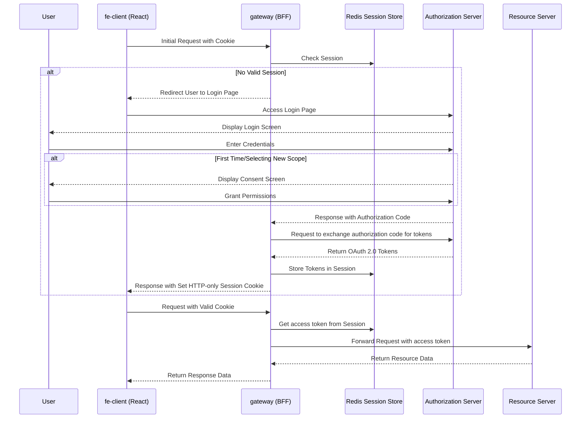

## Implementing BFF Pattern for Browser-Based Applications

### Introduction

In this blog post I will give you an example of how to implement OAuth 2.0 backend including BFF (Backend For Frontend) for
browser-based applications using Spring Security OAuth 2.0 authorization server, Spring Cloud Gateway for BFF,
Sprint OAuth 2.0 Resource Server and React as a frontend client.
In order to understand parts of this blog post it would be good to have a knowledge
about basic OAuth 2.0 concepts and flows. You can find these blog posts useful [Basic OAuth 2.0
concepts](https://goodbyeplanet-blog.vercel.app/post/oauth2-core-concepts/),
[Authorization Code Flow for Confidential Clients with BFF](https://goodbyeplanet-blog.vercel.app/post/authorization-code-flow-confidential-client/)

#### Why BFF is recommended for browser-based applications

The Backend for Frontend (BFF) in a simple words is a server side application which is designed to support different
front-end clients. One of the benefits of BFF and it's architecture is that it makes easier to secure client applications.
In the context of this blog post this pattern is strongly recommended for browser-based applications because
all token management and sensitive credential handling is handled on the secure server-side environment.
Instead of storing vulnerable access and refresh tokens in the browser where they're exposed to Cross-Site Scripting (XSS) attacks,
the BFF securely maintains these tokens server-side.
The browser only receives a secure, HTTP-only session cookie for BFF communication,
significantly reducing the application's attack surface and aligning with OAuth 2.0 security best practices.
[More on BFF architecture in context of OAuth 2.0](https://datatracker.ietf.org/doc/html/draft-ietf-oauth-browser-based-apps#section-6.1.1)

### Implementation of OAuth 2.0 backend with BFF pattern

Complete code can be found in this [Github repository](https://github.com/GoodbyePlanet/spring-cg-bff)
If you want to try it out just follow the steps in README.md.

##### Architecture Overview
Architecture of the application consists of the following components:

##### auth-server

The `auth-server` component serves as An Authorization Server implemented with Spring Boot and the OAuth 2.0 authorization server library.
It connects to MariaDB for storing OAuth 2.0 objects, including registered clients, consents, and authorizations.
If you run the app you can access MariaDB on http://localhost:8080/?server=oauth_db&username=oauth&db=oauth_db.
All configurations are implemented via Spring DSL (Domain-Specific Language) in Java.
The most important configuration is in [AuthorizationServerConfiguration.java](https://github.com/GoodbyePlanet/spring-cg-bff/blob/main/auth-server/src/main/java/com/app/auth_server/config/AuthorizationServerConfiguration.java).

##### secure-resource

The `secure-resource` component serves as a Resource Server implemented with Spring Boot and the OAuth 2.0 resource server library.
It manages and protects APIs by ensuring that access is granted only to authenticated and authorized clients.
For the demo purpose it has one controller for getting `/resource` that just returns text with currently authenticated user.

##### gateway

The `gateway` component serves as the Backend for Frontend (BFF) layer implemented using Spring Boot and Spring Cloud Gateway library.
It acts as a secure gateway between the frontend client and backend services,
handling token management and authentication while providing a secure session-based communication channel through HTTP-only cookies.
This component is crucial for enhancing security by keeping sensitive OAuth tokens server-side instead of exposing them to the browser,
with session data persisted in Redis DB for reliable state management.
If you run the app you can access Redis UI on http://localhost:8082.

##### fe-client

The `fe-client` is a Single Page Application (SPA) built using React that serves as the frontend interface for the system.
It communicates exclusively with the `gateway` (BFF) component through HTTP requests, leveraging HTTP-only cookies for session management and authentication.
This client-side application focuses purely on the user interface and business logic,
while delegating all security-sensitive operations like token management to the BFF layer.

#### Sequence Diagram



1. User initiates request through the frontend application
2. Gateway checks Redis for a valid session
3. If no valid session exists:
    - User is redirected to the login page hosted on Authorization Server
    - After successful login, the consent screen is shown if the user did not previously give his consent
    - Authorization code is exchanged for access and refresh tokens
    - Session is established with tokens stored in Redis
4. With a valid session:
    - Request flow goes through `gateway`
    - Gateway retrieves tokens from Redis
    - Authenticated requests including access token are made to resource server
    - Responses are returned to the frontend

##### Implementation parts

Let's now go through important parts of the code that is executed and which reflects
flow on the above sequence diagram.

Starting from `fe-client` (React) code.
```js
const axiosInstance = axios.create({
  baseURL: backendBaseUrl,
  withCredentials: true,
  xsrfCookieName: 'XSRF-TOKEN',
  xsrfHeaderName: 'X-XSRF-TOKEN',
});
```
Here we have a configuration for Axios, `baseUrl` sets a BFF backend URL.
`withCredentials: true` is important because it ensures that session cookies are sent with
each request to the backend. `xsrfCookieName: 'XSRF-TOKEN'` and `xsrfHeaderName: 'X-XSRF-TOKEN'`
are the settings that are telling Axios to look for the CSRF token in the cookie named
`XSRF-TOKEN` and to include that token in the HTTP header named `X-XSRF-TOKEN`, this ensures
that requests are coming from the legitimate frontend.

Next, when a client code executes in the user browser, [getUserInfo](https://github.com/GoodbyePlanet/spring-cg-bff/blob/45268092c70f4f92c30849403c7beb5b7808710d/fe-client/src/App.tsx#L20)
is called, this will either return 401 Unauthorized if the user doesn't have a active session, or
it will return a response with the user data. If there is no active session for the user `Login` button will
be present on the UI. When clicking on the `Login` button [login](https://github.com/GoodbyePlanet/spring-cg-bff/blob/45268092c70f4f92c30849403c7beb5b7808710d/fe-client/src/App.tsx#L16)
function is called. It sets location in the browser URL to the url of the BFF backend. This will redirect browser to the
BFF gateway. Why is this important and why not using XHR request to call BFF backend.
OAuth 2.0 Authorization Code flow, which will be initiated when BFF base URL is called inherently relies on browser redirects
to securely initiate and complete the authentication process. Redirects allow the browser to handle cross-origin navigation,
display the identity provider’s login UI (in this case login hosted by `auth-server`), and properly manage secure, HttpOnly cookies.
In contrast, XHR requests can’t follow redirects to external login pages, often run into CORS issues, and aren’t suitable for
handling interactive authentication flows.


